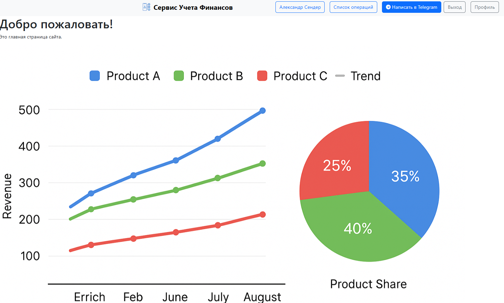
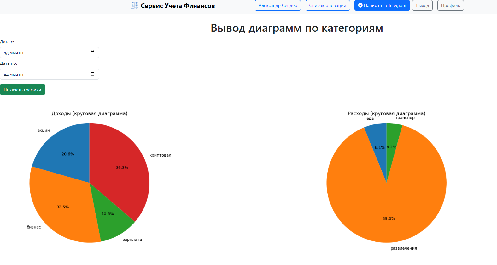
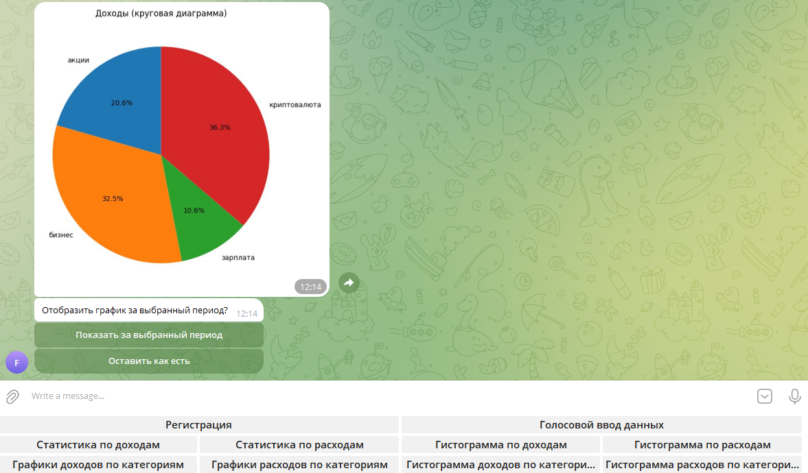

# DjangoTelegramFinControl

---

Сервис по учету финансов. Позволяет вносить свои ежедневные доходы и расходы производить
аналитику данных. Строить графики доходов и расходов за весь период, за введеный период,
производить аналитику данных по категориям как в доходах, так и расходах. На данный
момент в категории доходов входят ___зарплата___, ___акции___, ___криптовалюта____ 
и ___бизнес___, а в категории расходов входят ___еда___, ___развлечения___ и
___транспорт___. Все эти категории при необходимости можно добавить, удалить и
отредактировать.

---

## Особенности

---
* Для того чтобы пользоваться сервис нужно зарегистрироваться
  * регистрация может быть осуществлена через веб интерфейс
  * регистрация может быть осуществлена через _telegram_

* В своем личном кабинете (веб интерфейс) пользователь может:
    * добавлять свои доходы и расходы
    * просматривать список всех своих доходов и расходов
    * просматривать графики введенных данных в различных разрезах
    * также имеется возможность экспортировать свои графики в _MS Excel_

* В личном кабинете пользователь может перейти по ссылке в _телеграм_, в котором:
    * может добавлять свои данные о доходах и расходах с помощью голосового 
  ввода
    * просматривать свои записи за весь период или за указзаный период
    * просматривать графики своих доходов и расходов за весь период, за 
  введенный пользователем период
    * просматривать графики по имеющимся категориям в доходах и расходах
    * есть планировщик, который каждое утро показывает твои доходы и
  расходы за предыдущий день.
---

## Скриншоты
---
Главная страница | Аналитика данных | Работа сервиса в телеграме
:----|:----|:----|
||

---
## ⚙️ Установка

1. **Клонируйте репозиторий**:
   ```bash
   git clone https://github.com/SenderAlex/DjangoTelegramFinControl.git
   cd DjangoTelegramFinControl
   ```

2. **Установите зависимости**:
   ```bash
   pip install -r requirements.txt
   ```

3. **Запустите приложение**:
   ```bash
   python manage.py runserver
   python bot/bot.py
   ```

---

## 🛠 Структура проекта

```bash
DjangoTelegramFinControl/
├── bot/                 # Бот
├── ffmpeg/              # Утилита для преобразования голосового сообщения в текст
│   ├── bin/         
├── fincontrol_app/      # Приложение по учету финансов
│   ├── migrations/      # Миграции
│   ├── static/          # css и img
│   ├── templates/       # Шаблоны
├── fincontrol_project/
├── registration_app/    # Приложение регистрации пользователей
│   ├── migrations/      # Миграции
│   ├── templates/       # Шаблоны
├── screnshots/          # Скриншоты для README.md
├── manage.py            # Основной файл для запуска проекта
├── requirements.txt     # Зависимости
└── README.md            # Документация
```
---

## 🧰 Технологии
- **Backend**: Python + Django
- **База данных**: SQLite 3
- **Аналитика**: pandas, matplotlib
- **Telegram-bot**: aiogram
- **Планировщик задач**: Cron
- **Frontend**: Django templates + Bootstrap
- **Аутентификация**: Django Auth


---

## 📜 Лицензия
Проект распространяется под лицензией **MIT**. Подробнее см. в [LICENSE](LICENSE).

---

## 📮 Контакты
Автор: Александр Сендер

e-mail: alexander.sender@gmail.com